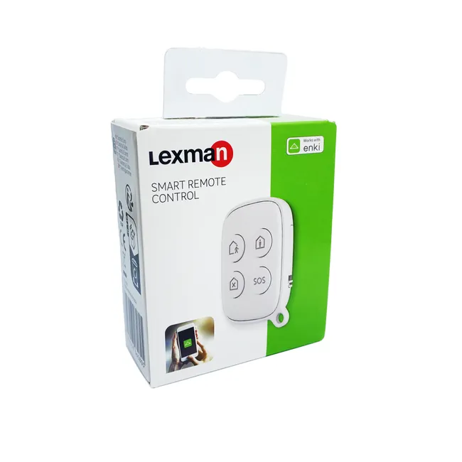

# Enki integration for Home Assistant (Unofficial)

[](https://github.com/hacs/integration)
[](https://github.com/StephaneBranly/ha-enki/releases/latest)

The unofficial Enki intregration for Home Assistant.


> [!NOTE]
> This custom component is relatively new. It does not include all Enki components and may contain bugs.

## Known devices:

<!-- start devices -->
| Name | Image | Id | Coverage (%) | Tested |
|---|---|---|---|---|
|Siren<br/>Lexman||*5f16c4aca80024b5af0561a1*||❌|
|RGB E27 Light<br/>Lexman||*5d7df749f8bb0659f50d263d*||✅|
|Alarm remote control<br/>Lexman||*5e8bad4e8eff8efc7c83ba49*||❌|
|Motion detector<br/>Lexman||*5e26cc33777472061d55e340*||❌|
|Contact detector<br/>Lexman||*5f1192bc23b5dec92ac93eb4*||❌|
|Connected thermometer<br/>Sedea||*6633842c9f53b36a99838c94*||✅|
<!-- end -->

<!-- - Eglo V-link tunable white
- Inspire Cadix ceiling fan with light
- Lexman RGBW Light -->

## Supported capabilities

Different device capabilities are curently being integrated to this custom component.

<details>

<summary>Capabilities coverage</summary>

<!-- start capabilities -->
| Capability | Coverage (%) |
|---|---|
|change_brightness||
|change_color_temperature||
|change_hue||
|change_light_state||
|change_saturation||
|check_battery_health||
|check_current_humidity||
|check_current_temperature||
|check_light_state||
|check_lighting_remote_state||
<!-- end -->

</details>

## Connect your Enki account

Reference your username and your password to connect to your Enki's account.

You can specifiy a refresh rate.

## Dev

### Live API test

This repository includes a standalone live diagnostics script that can authenticate against Enki
and print available devices/actions from your account. This can help to develop and debug the
component against the real API.

Before running it locally, install runtime dependencies:

```bash
python -m pip install aiohttp
```

Run the script with credentials as parameters:

```bash
python tools/enki_api_live.py --user "your-email@example.com" --password "your-password"
```

You can also use environment variables:

```bash
export ENKI_USER="your-email@example.com"
export ENKI_PASSWORD="your-password"
python tools/enki_api_live.py
```

> [!NOTE]
> This repository is based on the excellent [CyrilP/hass-enki-component](https://github.com/CyrilP/hass-enki-component) repository, which did not appear to be maintained in a consistent and sustainable manner.
