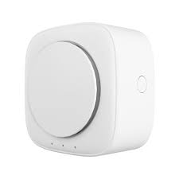
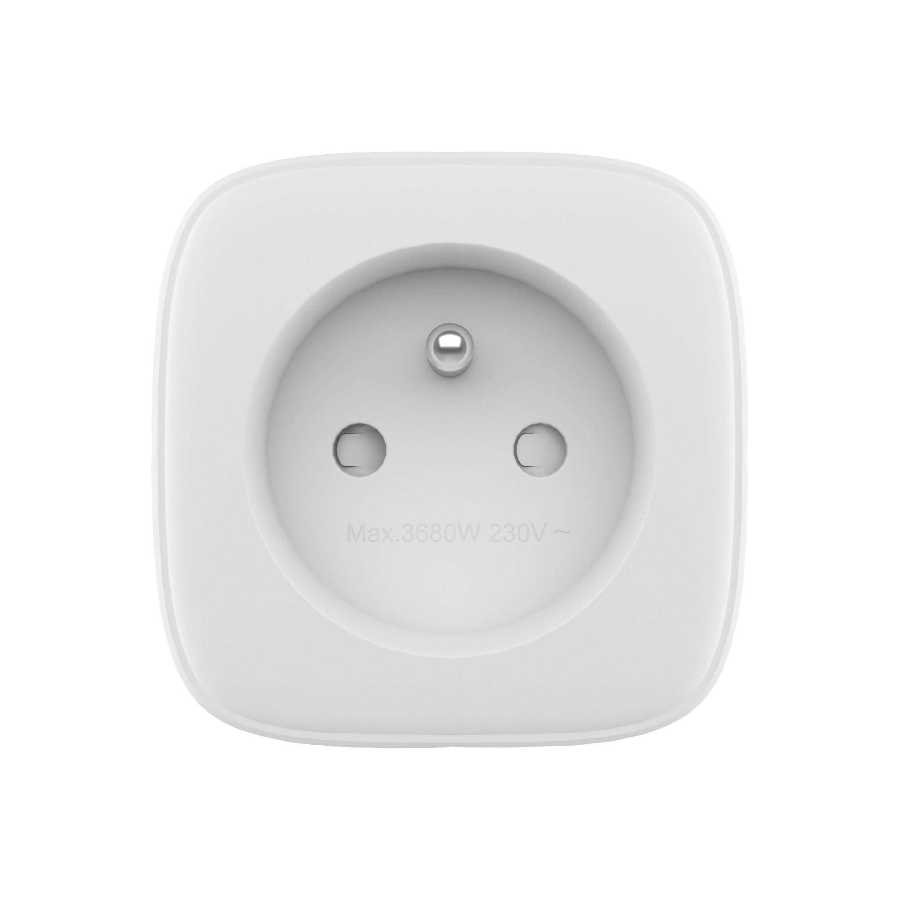
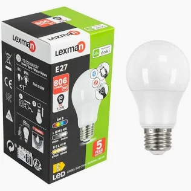
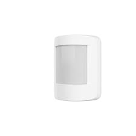
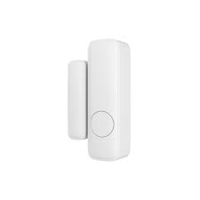
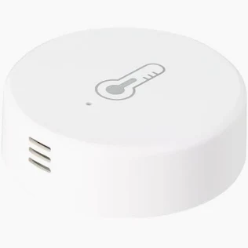

# Enki integration for Home Assistant (Unofficial)

[](https://github.com/hacs/integration)
[](https://github.com/StephaneBranly/ha-enki/releases/latest)

[](https://my.home-assistant.io/redirect/hacs_repository/?owner=StephaneBranly&repository=ha-enki&category=integration)

The unofficial Enki intregration for Home Assistant.


> [!NOTE]
> This custom component is relatively new. It does not include all Enki components and may contain bugs.

> [!TIP]
> Quickly test the integration of your current devices with a single Python command! Check Live API test

## Known devices:

<!-- start devices -->

| Name                            | Image                                                                 | Id                         | Coverage (%)                          | Tested |
| ------------------------------- | --------------------------------------------------------------------- | -------------------------- | ------------------------------------- | ------ |
| Siren<br/>Lexman                |   | _5f16c4aca80024b5af0561a1_ |    | ❌     |
| Outlet 16A, 3680A<br/>Lexman    |  | _5e258991b472bf9d87b8483f_ |    | ✅     |
| RGB E27 Light<br/>Lexman        |  | _5d7df749f8bb0659f50d263d_ |    | ✅     |
| Motion detector<br/>Lexman      |   | _5e26cc33777472061d55e340_ |  | ✅     |
| Contact detector<br/>Lexman     |   | _5f1192bc23b5dec92ac93eb4_ |    | ✅     |
| Connected thermometer<br/>Sedea |  | _6633842c9f53b36a99838c94_ |  | ✅     |

<!-- end -->

<!-- - Eglo V-link tunable white
- Inspire Cadix ceiling fan with light
- Lexman RGBW Light -->

## Supported capabilities

Different device capabilities are curently being integrated to this custom component.

<details>

<summary>Capabilities coverage</summary>

<!-- start capabilities -->

| Capability                           | Coverage (%)                          |
| ------------------------------------ | ------------------------------------- |
| ENKI_HOMES_LIST                      |  |
| ENKI_BFF_ITEMS                       |  |
| ENKI_NODE_CAPABILITY                 |  |
| change_light_state                   |  |
| check_light_state                    |  |
| check_current_temperature            |  |
| check_current_humidity               |  |
| check_fan_speed                      |  |
| check_fan_rotation_direction         |  |
| check_airflow_mode                   |  |
| change_fan_speed                     |  |
| change_fan_rotation_direction        |  |
| change_airflow_mode                  |  |
| switch_electrical_power              |  |
| check_electrical_power               |  |
| check_battery_health                 |  |
| check_motion_detection               |  |
| check_motion_detector_state          |  |
| check_contact_sensor_state           |  |
| check_vibration_detection            |  |
| check_vibration_detection_activation |  |
| activate_vibration_detection         |  |
| check_contact_detection_activation   |  |
| activate_contact_detection           |  |
| check_vibration_sensibility_level    |  |
| change_vibration_sensibility_level   |  |

<!-- end -->

</details>

## Connect your Enki account

Reference your username and your password to connect to your Enki's account.

You can specifiy a refresh rate.

## Dev

### Live API test

This repository includes a standalone live diagnostics script that can authenticate against Enki
and print available devices/actions from your account. This can help to develop and debug the
component against the real API.

Before running it locally, install runtime dependencies:

```bash
python -m pip install aiohttp prettytable
```

Run the script with credentials as parameters:

```bash
python tools/enki_api_live.py --user "your-email@example.com" --password "your-password"
```

You can also use environment variables:

```bash
export ENKI_USER="your-email@example.com"
export ENKI_PASSWORD="your-password"
python tools/enki_api_live.py
```

Expected output

```bash
Fetching all devices...

Devices found: 15
+----+-----------------------+------------------------------+-----------+---------+--------+-----------------------+---------------+
| #  |          Name         |         Device type          | Device ID | Node ID | Status | Expected coverage (%) |   Protocols   |
+----+-----------------------+------------------------------+-----------+---------+--------+-----------------------+---------------+
| 1  |  Détecteur mouvements |           sensors            |    ...    |   ...   | Known  |          100          |     zigbee    |
| 2  |  Télécommande alarme  | remote_controls_and_switches |    ...    |   ...   | Known  |           0           |     zigbee    |
| 3  |       Ampoule 1       |            lights            |    ...    |   ...   |  NEW!  |           44          |     zigbee    |
| 4  |        Prise 2        |           outlets            |    ...    |   ...   | Known  |           28          |     zigbee    |
| 5  |         Caméra        |           cameras            |    ...    |   ...   | Known  |           0           | lexman_camera |
| .. |          ....         |             ...              |    ...    |   ...   |  ...   |          ...          |      ...      |
| 14 |   Thermomètre rouge   |           sensors            |    ...    |   ...   | Known  |          100          |     zigbee    |
| 15 |  Détecteur ouverture  |           sensors            |    ...    |   ...   | Known  |           90          |     zigbee    |
+----+-----------------------+------------------------------+-----------+---------+--------+-----------------------+---------------+

You have devices that haven't been listed or tested in this library yet.
Please submit a documentation PR to add them; you can add their names and include an image by editing the corresponding JSON files in the folder doc/devices

 - #3 > 5d7df749f8bb0659f50d263d (Ampoule 1)
```

---

> [!NOTE]
> This repository is based on the excellent [CyrilP/hass-enki-component](https://github.com/CyrilP/hass-enki-component) repository, which did not appear to be maintained in a consistent and sustainable manner.
